# 🛡️ Aero-Partition-Hypervisor: ARINC 653 Style Separation Kernel


<p align="center">
  <strong>✈️  An Architectural Design Study of a Bare-Metal Partitioning Kernel for Safety-Critical Systems.</strong><br>
  <strong>⚙️ Conceived by Youssef ATTIA</strong>
</p>

---

## ⚡ Executive Summary
This project implements a **Zero-Trust Separation Kernel** for Integrated Modular Avionics (IMA). It addresses the critical failure mode: **"Propagation of Faults"** (e.g., a buggy In-Flight Entertainment system corrupting the memory of the Flight Control Computer).

By exploiting the **ARM Cortex-M4 Memory Protection Unit (MPU)** and the **PendSV Exception Model**, this kernel guarantees strict **Time and Space Partitioning**. It enforces a "Dynamic Iron Curtain" that physically re-wires the memory map every millisecond, ensuring that a crashed user partition cannot affect the kernel or other critical tasks.

---

## 🏗️ Architecture: The "Dynamic Iron Curtain"

The system utilizes a time-triggered architecture where the MPU is dynamically reconfigured at every context switch.

```mermaid
flowchart TD
    %% --- Global Styling ---
    classDef kernel fill:#f0f8ff,stroke:#00509d,stroke-width:2px,color:#00296b,rx:5,ry:5;
    classDef user fill:#fffaf0,stroke:#d4a373,stroke-width:2px,color:#9c6644,rx:5,ry:5;
    classDef hardware fill:#ffffff,stroke:#6c757d,stroke-width:1px,stroke-dasharray: 5 5,color:#495057;
    classDef hazard fill:#ffebee,stroke:#d32f2f,stroke-width:2px,color:#b71c1c;

    %% --- Hardware Layer ---
    subgraph HW ["HARDWARE TRIGGERS"]
        Tick(("⏱️ SysTick 1ms")):::hardware
    end

    %% --- Kernel Space ---
    subgraph KERNEL ["🛡️ KERNEL SPACE (Privileged)"]
        direction TB
        Sched["⚙️ Scheduler & Context Switch"]:::kernel
        MPU["🔐 MPU Dynamic Reconfiguration"]:::kernel
        Reset["🔥 Safety Reset"]:::hazard
    end

    %% --- User Space ---
    subgraph USER ["⚠️ USER SPACE (Unprivileged)"]
        direction TB
        PartA["✈️ Partition A: Landing Gear"]:::user
        PartB["⛽ Partition B: Fuel System"]:::user
    end

    %% --- The Control Loop ---
    Tick ==>|1. Interrupt| Sched
    Sched ==>|2. Select Next Task| MPU
    
    MPU ==>|3. Lock Memory & Launch| PartA
    MPU ==>|3. Lock Memory & Launch| PartB

    %% --- Returns & Faults ---
    PartA -.->|4. SVC Yield| Sched
    PartB -.->|4. SVC Yield| Sched
    
    PartA -- Memory Violation --> Reset
    PartB -- Stack Overflow --> Reset
    Reset -.->|Reboot System| Sched

    %% --- Link Styling ---
    linkStyle 0,1,2,3 stroke:#00509d,stroke-width:3px;
    linkStyle 4,5 stroke:#d4a373,stroke-width:2px,stroke-dasharray: 5 5;
    linkStyle 6,7 stroke:#d32f2f,stroke-width:2px;
```


---
## 📂 Project Manifest

Each file in this repository maps to a specific layer of the **ARINC 653** safety hierarchy:

### 🧠 Kernel Core (The "Brain")
* **`src/boot.s`**: The **Root of Trust**. Initializes the vector table, sets up the C-runtime environment (if needed), and hands off control to `kernel_main`.
* **`src/tcb.s`**: The **Scheduler State**. Defines the `Task Control Block` structures that track the Stack Pointer (PSP) and MPU permissions for every active partition.
* **`src/task_init.s`**: The **Loader**. Manually fabricates the initial CPU stack frames, "faking" a suspended state so tasks can be launched via a context restore.
* **`src/systick.s`**: The **Timekeeper**. Configures the hardware timer to trigger the scheduler every 1ms (+/- 0.05%), ensuring deterministic execution slots.

### 🛡️ Safety & Security (The "Shield")
* **`src/mpu_config.s`**: The **Static Defense**. Locks down the Kernel Flash and RAM so that no user task can ever overwrite the operating system code.
* **`src/context_switch.s`**: The **Dynamic Defense**. The "Magic" routine that saves CPU state and **physically re-programs the MPU hardware** on the fly to isolate the next running task.
* **`src/fault_handler.s`**: The **Safety Net**. Catches HardFaults, MemManage Faults, and Stack Overflows, triggering a deterministic System Reset (AIRCR) instead of undefined behavior.

### 🔌 Interfaces (The "Gateway")
* **`src/syscalls.s`**: The **API Gateway**. Implements the `SVC` (Supervisor Call) handler, allowing user tasks to request services (like `Yield`) without elevating privileges.
* **`src/tasks.s`**: The **User Application**. Contains the isolated flight software partitions (Landing Gear, Fuel System) that run in Unprivileged Mode.

### 🏗️ Build & Infrastructure (The "Blueprint")
* **`linker.ld`**: The **Memory Map**. Defines the rigid physical addresses for Kernel vs. User space and contains **Build-Time Assertions** to prevent memory overlap.
* **`Makefile`**: The **Traceability Tool**. Orchestrates the build, generates `.map` files for audit, and performs stack usage analysis (`-fstack-usage`).

* # 🚀 How to Run (Hardware-in-the-Loop)

## 1. Prerequisites

### Hardware
- STM32F4 Discovery (or any Cortex-M4F board)

### Toolchain
- `arm-none-eabi-gcc`
- `make`
- `st-flash` (from `stlink-tools`)

### Debugger (Optional)
- `OpenOCD` or `GDB` (for visualization)

---

## 2. Build & Analyze

This project includes a safety-critical build system that generates stack usage reports.

### Clone the Repository

### STM32 Aero Kernel Build & Debug Guide

## 1. Compile & Verify

Build the project using `make`:

```bash
make
```
## 2. Flash & Observe

Flash the binary to your STM32 device:

```bash
st-flash write aero_kernel.bin 0x08000000
```
## 3. Verify via GDB

### Start the GDB Server
In a separate terminal, start OpenOCD:

```bash
openocd -f board/stm32f4discovery.cfg
```
### Connect and Debug

Launch GDB:

```bash
arm-none-eabi-gdb aero_kernel.elf
```
### Inside GDB

```gdb
(gdb) target remote :3333
(gdb) break PendSV_Handler
(gdb) continue
```
### Observation

Once the breakpoint hits, check the MPU registers:

```gdb
(gdb) print/x *0xE000ED9C  # Check MPU_RBAR (Region Base Address)
(gdb) print/x *0xE000EDA0  # Check MPU_RASR (Region Attribute and Size)
```


